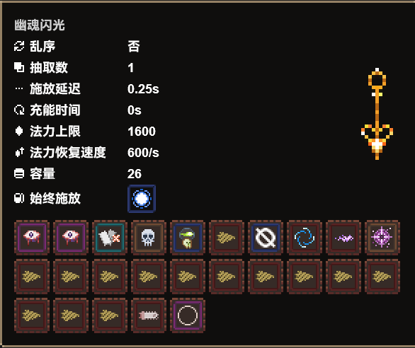

# NoitaLib
<!--  -->


基于[`Web Component`](https://developer.mozilla.org/zh-CN/docs/Web/API/Web_components)技术构建的 [**Noita**](https://noitagame.com/) 游戏UI元素工具库
目前法术数据已经跟进至**beta版**[^1]


  

---
## 引入
### 通过html script元素引入
```html
<script src="noitaLib.js"></script>
```
### 通过js impot语句引入
* 使用index.mjs的版本
* 或者在普通版本的`"use strict";`后加上`export `
```js
// ES6 module
import noitaLib from "noitaLib.js";
```

## 构建
需要预先安装node环境, 在vscode调试中运行build即可
也可以手动执行build.js
在`out`目录会生成`index.js`和`index.mjs`(es6模块)

## 在`html` 中使用
### 法术
```html
<noita-spell
    spell.id="法术ID"
    spell.name="法术名(伟大汉化)"
    spell.expression="法术查询表达式"
    display="显示模式"
><noita-spell/>
```
### 图标模式
#### 通过 `id/name` 指定单个法术
```html
<noita-spell spell.id="BOMB" display="icon"></noita-spell>
```

#### 通过 `expression` 指定多个法术
```html
<noita-spell spell.expression="#type_passive" display="icon"></noita-spell>
```

### 面板模式
#### 通过 `id/name` 指定单个法术


```html
<noita-spell spell.id="BOMB" display="panel"></noita-spell>
```

#### 通过 `expression` 指定多个法术
```html
<noita-spell spell.expression="#type_passive" display="panel"></noita-spell>
```


### 法杖
```html
<noita-wand
    wand.name="法杖名"
    wand.shuffle="乱序(true/false)"
    wand.draw="抽取数"
    wand.fire-rate-wait="施放延迟"
    wand.reload-time="充能时间"
    wand.capacity="容量"
    wand.mana-max="法力上限"
    wand.mana-charge-speed="法力恢复速度"
    wand.spread-degrees="散射"
    wand.speed-multiplier="投射速度倍数"
    wand.static-spells="始终施放法术(法术序列表达式)"
    wand.dynamic-spells="填充法术(法术序列表达式)"
    display="显示模式"
><noita-wand/>
```
#### 图标模式
- [ ] 待实现
#### 面板模式
```html
<noita-wand
    display="panel"
    wand.name="幽魂闪光"
    wand.capacity="26"
    wand.draw="1"
    wand.fire-rate-wait="15"
    wand.reload-time="0"
    wand.shuffle="false"
    wand.spread-degrees="0"
    wand.speed-multiplier="1"
    wand.mana-charge-speed="600"
    wand.mana-max="1600"
    wand.static-spells="MANA_REDUCE:-1"
    wand.dynamic-spells="
        BLOOD_MAGIC:2
        BURST_X
        ADD_DEATH_TRIGGER
        CURSE_WITHER_PROJECTILE
        [DIGGER|POWERDIGGER|CHAINSAW]
        NOLLA SPIRAL_SHOT
        LIGHT_BULLET SUMMON_PORTAL:-1
        [
            DIGGER|
            POWERDIGGER|
            MATERIAL_WATER|
            MATERIAL_OIL|
            MATERIAL_BLOOD|
            MATERIAL_ACID|
            MATERIAL_CEMENT
        ]:13
        CHAINSAW
        RESET
    "
></noita-wand>
```

## 在 `javascript` 中使用
入口常量: `noitaLib`
```js

noitaLib.entity.HTMLElement // HTMLElement 构造器 <noita-entity>
noitaLib.entity.queryById("BOMB") //DB.entity {id: 'BOMB', name: '炸弹'... }
noitaLib.spell.HTMLElement // HTMLElement 构造器 <noita-spell>
noitaLib.spell.queryByName("炸弹") //DB.spell {id: "BOMB", name: "炸弹", 
noitaLib.spell.queryById("BOMB") //DB.spell {id: "BOMB", name: "炸弹", description: "召唤一枚对地形破坏力极大的炸弹" ...}
noitaLib.wand.HTMLElement // HTMLElement 构造器 <noita-wand>
noitaLib.perk.HTMLElement // HTMLElement 构造器 <noita-perk>
noitaLib.perk.queryByName("暴击率 +") // DB.perk {id: 'CRITICAL_HIT', name: '暴击率 +', description: '提高你所有法术的暴击率' ...}
noitaLib.perk.queryById("CRITICAL_HIT") // DB.perk {id: 'CRITICAL_HIT', name: '暴击率 +', description: '提高你所有法术的暴击率' ...}

noitaLib.cursor.add() // 添加游戏风格十字光标
noitaLib.cursor.remove() // 移除游戏风格十字光标
```
## 法术查询表达式
### Token
* [法术ID](https://github.com/Caramel-Diode/Noita_Lib/wiki/%E6%B3%95%E6%9C%AFID%E2%80%90%E5%90%8D%E7%A7%B0%E5%88%97%E8%A1%A8)
  ```regex
  [A-Z_]+[0-9A-Z_]*
  ```
  ```bnf
  法术id ::=
      <大写字母|_>(大写字母|数字|_)*
  ```
* [法术标签](https://github.com/Caramel-Diode/Noita_Lib/wiki/%E6%B3%95%E6%9C%AF%E6%A0%87%E7%AD%BE%E5%88%97%E8%A1%A8)
  ```regex
  #[0-9A-Za-z_]*
  ```
  ```bnf
  法术标签 ::=
      #(大写字母|小写字母|数字|_)*
  ```
* 集合运算符 **交** **并** **补**
  `&`, `|`, `!`
* 优先级运算符
  `(`, `)`
### 语法
* **`法术ID`** 与 **`法术标签`** 均表示法术集合 **`法术ID`** 为单个法术构成的法术集合
* **`集合运算符`** 表示集合之间的运算
* **`法术ID`** 与 **`法术标签`** 之前使用逻辑运算符进行连接
* 通过 **`优先级运算符`** 来控制优先级
* BNF定义
  ```bnf
  法术查询表达式 ::=
      集合运算表达式
  优先集合运算表达式 ::=
      "("集合运算表达式")"
  集合运算表达式 ::=
      (基本法术集合|集合运算表达式|优先集合运算表达式)(<集合运算符>(基本法术集合|集合运算表达式|优先集合运算表达式))*
  基本法术集合 ::=
      法术ID|法术标签
  集合运算符 ::=
      "&"|"|"|"!"
  ```

### 示例
```js
noitaLib.spell.queryByExpression(法术查询表达式)
```

```
#type_projectile|RESET
```
所有投射物法术加`魔杖刷新`
```
#type_modifier&#mana_0
```
所有蓝耗为0的修正法术
```
DIGGER|POWERDIGGER|CHAINSAW
```
`挖掘魔弹`、`挖掘爆破` 和 `链锯`
## 法术序列表达式

### Token
* [法术ID](https://github.com/Caramel-Diode/Noita_Lib/wiki/%E6%B3%95%E6%9C%AFID%E2%80%90%E5%90%8D%E7%A7%B0%E5%88%97%E8%A1%A8)
* 可替换法术
  ```bnf
  可替换法术 ::= "["[法术查询表达式]"]"
  ```
* 法术重复次数
  ```regex
  :[-0-9]+
  ```
  ```bnf
  法术剩余次数 ::=
      :[-]<数字>{数字}
  ```
* 法术剩余次数
  ```regex
  ^[-0-9]+
  ```
  ```bnf
  法术重复次数 ::=
      ^[-]<数字>{数字}
  ```

### 语法
* 可替换法术使用`[]`包裹`法术查询表达式`构成 表示此处有多个可替换的法术(表现为轮播)
* 固定法术由法术ID构成 表示该位置仅允许此法术
* 使用`^`拼接`数量` 表示该法术的剩余次数 默认为无限
* 使用`:`拼接`数量` 表示该法术在序列中向右重复的次数 负数则代表此法术为非必要法术(表现为闪烁) 默认为1
* 法术序列由`可替换法术`和`固定法术`及其附加信息构成
* BNF定义
  ```
  法术序列表达式 ::=
      基本法术单元*
    基本法术单元 ::=
      (法术ID|可替换法术)[(<法术重复次数> <法术剩余次数>)|(<法术剩余次数> <法术重复次数>)|<法术剩余次数>|<法术重复次数>]
  ```

### 示例
```html
<noita-wand wand.dynamic-spells="法术序列表达式"></noita-wand>
```
```
BURST_2 LIGHT_BULLET CHAINSAW
```
    
tips: 链锯在施法块最后预载可以将施法块释放延迟归零
```
RESET [ #type_passive]:3
```
    
tips: 一般情况下将被动法术置于`魔杖刷新`之后将免于耗蓝
```
LIGHT_BULLET_TRIGGER [HOMING_SHORT|HOMING]:-1 [LASER_EMITTER|LASER_EMITTER_FOUR|LASER_EMITTER_CUTTER]
```
    
tips: 使用`电浆`可以有效快速的击杀`独眼` 使用`触发弹`施放它可以免于`电浆`对自己造成伤害 使用`追踪`修正以保证电浆命中的稳定性(当然这不是必须的)

未完待续...
[^1]: master build-Aug 29 2023.