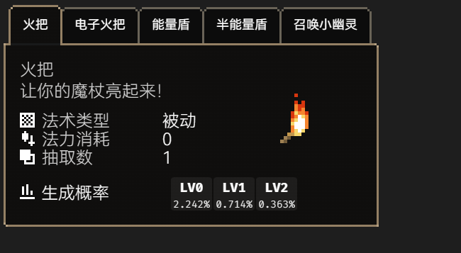
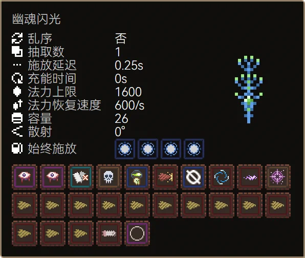

# NoitaLib
<!--  -->


基于[`Web Component`](https://developer.mozilla.org/zh-CN/docs/Web/API/Web_components)技术构建的 [**Noita**](https://noitagame.com/) 游戏UI元素工具库


  

---
## 使用(部分展示)
### 通过html script元素引入
```html
<script src="noitaLi.sf.js"></script>
```
### 通过js impot语句引入
* 使用index.mjs的版本
* 或者在普通版本的`"use strict";`后加上`export `
```js
// ES6 module
// 入口导入
import noitaLib from "noitaLib.esm.js";
// 或
import {/* 仅导入部分 */} from "noitaLib.esm.js"
```
### 开发者模式
开启后控制台将会显示开发相关信息
```js
noitaLib("dev"); // 启用开发者模式
```
## 构建
需要预先安装node环境, 在vscode调试中运行build即可
也可以手动执行build.js
在`out`目录会生成`noitaLib.esm(.sf).js`、`noitaLib(.sf).mjs`(es6模块) 与一些资源文件  
sf表示单文件形式 一般会使用此版本
## 法术组件
```html
<!-- 图标模式(display可缺省) -->
<noita-spell display="icon" spell.id="BOMB"></noita-spell>
<!-- 面板模式 -->
<noita-spell display="panel" spell.id="BOMB"></noita-spell>
<!-- 面板模式(指定多个法术) -->
<noita-spell display="panel" spell.exp="#type_passive"></noita-spell>
```
```js
const spellData = noitaLib.Spell.query("BOMB");
const element = new noitaLib.Spell([spellData]); // 可以通过数组传入多个spellData
// 或者 ...
const element = new noitaLib.Spell({ id: "BOMB" }); // 通过配置对象指定ID
const element = new noitaLib.Spell({ exp: "#type_passive" }); // 通过配置对象指定查询表达式
```


## 魔杖组件
```html
<!-- 完整模式 -->
<noita-wand
    display="panel"
    wand.name="幽魂闪光"
    wand.capacity="26"
    wand.draw="1"
    wand.fire-rate-wait="15"
    wand.reload-time="0"
    wand.shuffle="false"
    wand.spread-degrees="0"
    wand.speed-multiplier="1"
    wand.mana-charge-speed="600"
    wand.mana-max="1600"
    wand.static-spells="MANA_REDUCE:0~4"
    wand.dynamic-spells="
        BLOOD_MAGIC:2
        BURST_X
        ADD_DEATH_TRIGGER
        CURSE_WITHER_PROJECTILE
        [DIGGER|POWERDIGGER|CHAINSAW]
        NOLLA SPIRAL_SHOT
        LIGHT_BULLET SUMMON_PORTAL:-1
        [
            DIGGER|
            POWERDIGGER|
            MATERIAL_WATER|
            MATERIAL_OIL|
            MATERIAL_BLOOD|
            MATERIAL_ACID|
            MATERIAL_CEMENT
        ]:13
        CHAINSAW
        RESET
    "
></noita-wand>
<!-- 简易模式(此时允许显示警告图标) -->
<noita-wand
    display="panel-simple"
    display.mana-warning="true"
    wand.icon="康特勒琴"
    wand.mana-max="2"
    wand.fire-rate-wait="3"
    wand.capacity="20"
    wand.dynamic-spells="BLACK_HOLE^3 SUMMON_ROCK^3 NUKE^1"
></noita-wand>
```
```js
const element = new noitaLib.Wand({ data: { name:"", capacity: 26, draw: 26, fireRateWait: 15...} });
```


## 法术查询表达式
### Token
* [法术ID](https://github.com/Caramel-Diode/Noita_Lib/wiki/%E6%B3%95%E6%9C%AFID%E2%80%90%E5%90%8D%E7%A7%B0%E5%88%97%E8%A1%A8)
  ```regex
  [A-Z_]+[0-9A-Z_]*
  ```
  ```bnf
  法术id ::=
      <大写字母|_>(大写字母|数字|_)*
  ```
* [法术标签](https://github.com/Caramel-Diode/Noita_Lib/wiki/%E6%B3%95%E6%9C%AF%E6%A0%87%E7%AD%BE%E5%88%97%E8%A1%A8)
  ```regex
  #[0-9A-Za-z_]*
  ```
  ```bnf
  法术标签 ::=
      #(大写字母|小写字母|数字|_)*
  ```
* 集合运算符 **交** **并** **补**
  `&`, `|`, `!`
* 优先级运算符
  `(`, `)`
### 语法
* **`法术ID`** 与 **`法术标签`** 均表示法术集合 **`法术ID`** 为单个法术构成的法术集合
* **`集合运算符`** 表示集合之间的运算
* **`法术ID`** 与 **`法术标签`** 之前使用逻辑运算符进行连接
* 通过 **`优先级运算符`** 来控制优先级
* BNF定义
  ```bnf
  法术查询表达式 ::=
      集合运算表达式
  优先集合运算表达式 ::=
      "("集合运算表达式")"
  集合运算表达式 ::=
      (基本法术集合|集合运算表达式|优先集合运算表达式)(<集合运算符>(基本法术集合|集合运算表达式|优先集合运算表达式))*
  基本法术集合 ::=
      法术ID|法术标签
  集合运算符 ::=
      "&"|"|"|"!"
  ```

### 示例
```js
noitaLib.spell.queryByExpression(法术查询表达式)
```

```
#type_projectile|RESET
```
所有投射物法术加`魔杖刷新`
```
#type_modifier&#mana_0
```
所有蓝耗为0的修正法术
```
DIGGER|POWERDIGGER|CHAINSAW
```
`挖掘魔弹`、`挖掘爆破` 和 `链锯`
## 法术序列表达式

### Token
* [法术ID](https://github.com/Caramel-Diode/Noita_Lib/wiki/%E6%B3%95%E6%9C%AFID%E2%80%90%E5%90%8D%E7%A7%B0%E5%88%97%E8%A1%A8)
* 可替换法术
  ```bnf
  可替换法术 ::= "["[法术查询表达式]"]"
  ```
* 法术重复次数
  ```regex
  :[0-9]+(~[0-9]+)?
  ```
  ```regex
  :~[0-9]+
  ```
  ```bnf
  重复次数 ::= :(<数字>{数字}[~<数字>{数字}] | ~<数字>{数字})
  ```
* 剩余次数
  ```regex
  \^[0-9]+
  ```
  ```bnf
  剩余次数 ::= ^<数字>{数字}
  ```

### 语法
* 可替换法术使用`[]`包裹`法术查询表达式`构成 表示此处有多个可替换的法术(表现为轮播)
* 固定法术由法术ID构成 表示该位置仅允许此法术
* 使用`^`拼接`数量` 表示该法术的剩余次数 默认为无限
* 使用`:`拼接`数量` 表示该法术在序列中向右重复的次数 默认为1 使用拼接`~`和一个数值用于表示最小重复次数和最大重复次数 最小重复次数为0允许省略 即`:~3`
* 法术序列由`可替换法术`和`固定法术`及其附加信息构成
* BNF定义
  ```
  法术序列表达式 ::= {基本法术单元}
  基本法术单元 ::= (法术ID|可替换法术)([重复次数][剩余次数] | [剩余次数][重复次数])
  ```

### 示例
```html
<noita-wand wand.dynamic-spells="法术序列表达式"></noita-wand>
```
```js
BURST_2 LIGHT_BULLET CHAINSAW
```
    
tips: 链锯在施法块最后预载可以将施法块释放延迟归零
```js
RESET [ #type_passive]:3
```
    
tips: 一般情况下将被动法术置于`魔杖刷新`之后将免于耗蓝
```js
LIGHT_BULLET_TRIGGER [HOMING_SHORT|HOMING]:~1 [LASER_EMITTER|LASER_EMITTER_FOUR|LASER_EMITTER_CUTTER]
```
    
tips: 使用`电浆`可以有效快速的击杀`独眼` 使用`触发弹`施放它可以免于`电浆`对自己造成伤害 使用`追踪`修正以保证电浆命中的稳定性(当然这不是必须的)

未完待续...